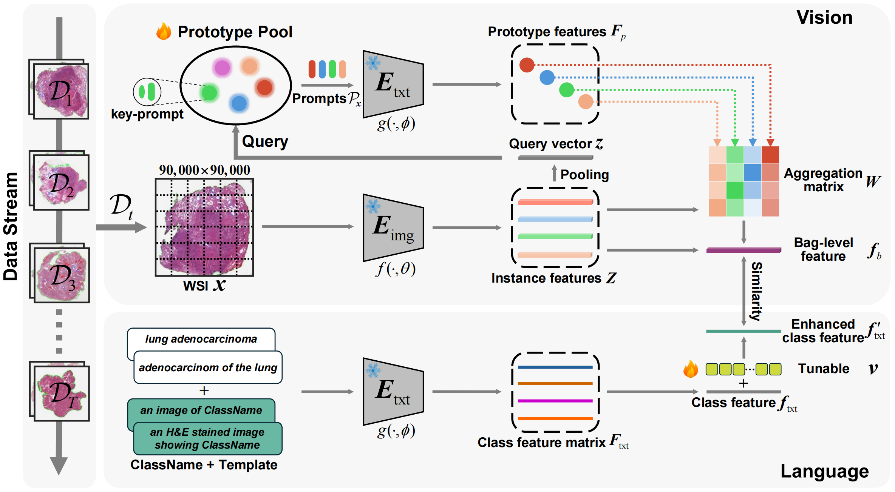

QPMIL-VL ✨ <a href="https://www.scse.uestc.edu.cn/">  </a>
===========

## Queryable Prototype Multiple Instance Learning with Vision-Language Models for Incremental Whole Slide Image Classification

Accepted by *[AAAI 2025](https://aaai.org/conference/aaai/aaai-25/)*

[[Paper]](https://arxiv.org/abs/2410.10573) | [[Running the Code]](https://github.com/can-can-ya/QPMIL-VL?tab=readme-ov-file#-running-the-code) | [[Acknowledgments]](https://github.com/can-can-ya/QPMIL-VL?tab=readme-ov-file#-acknowledgments) | [[License and Terms of Use]](https://github.com/can-can-ya/QPMIL-VL?tab=readme-ov-file#-license-and-terms-of-use) | [[Citation]](https://github.com/can-can-ya/QPMIL-VL?tab=readme-ov-file#-citation)

**Abstract**: Whole Slide Image (WSI) classification has very significant applications in clinical pathology, *e.g.*, tumor identification and cancer diagnosis. Currently, most research attention is focused on Multiple Instance Learning (MIL) using *static* datasets. One of the most obvious weaknesses of these methods is that they cannot efficiently preserve and utilize previously learned knowledge. With any new data arriving, classification models are required to be re-trained on both previous and current new data. To overcome this shortcoming and break through traditional vision modality, this paper proposes the first *Vision-Language*-based framework with *Queryable Prototype Multiple Instance Learning* (QPMIL-VL) specially designed for incremental WSI classification. This framework mainly consists of two information processing branches: one is for generating bag-level features by prototype-guided aggregation of instance features, while the other is for enhancing class features through a combination of class ensemble, tunable vector and class similarity loss. The experiments on four public WSI datasets demonstrate that our QPMIL-VL framework is effective for incremental WSI classification and often significantly outperforms other compared methods, achieving state-of-the-art (SOTA) performance.

<div align="center">
  <a href="https://arxiv.org/pdf/2410.10573">
    
  </a>
</div>

---

### 📚 Recent Updates

- **12/15/2024**: Update our prepared [dataset](https://pan.baidu.com/s/1DB83xR7HBw4eS9WxlRJN6g?pwd=4yri) to facilitate direct **online viewing of the dataset's file organization** and allow for **on-demand downloading of specific files**.
- **12/10/2024**: Code & [paper](https://arxiv.org/abs/2410.10573) (containing **Supplementary Material**) are live.

*On updating. Stay tuned.*

## 👩‍💻 Running the Code

### 1. CONCH Pre-trained Weight

First of all, you could download the pre-trained weight of pathology VLM CONCH [here](https://huggingface.co/MahmoodLab/CONCH/tree/main) (official link).

### 2. WSI Preprocessing

We use [CLAM](https://github.com/mahmoodlab/CLAM) to crop non-overlapping `256 × 256` patches from the segmented tissue at `10×` magnification. Then, pre-trained image encoder in [CONCH](https://github.com/mahmoodlab/CONCH) is used to extract instance features. You could move to [Pipeline-Processing-TCGA-Slides-for-MIL](https://github.com/liupei101/Pipeline-Processing-TCGA-Slides-for-MIL) for a detailed tutorial.

**Of course, you could also use the [dataset](https://pan.baidu.com/s/1DB83xR7HBw4eS9WxlRJN6g?pwd=4yri) we prepared directly (corresponding compressed file is [here](https://pan.baidu.com/s/15ZxpXI2zqVuBb7gsqv_DTA?pwd=gd30)).**

### 3. Running Environment

All experiments are run on a machine with

- two NVIDIA GeForce RTX 3090 GPUs
- python==3.8 and pytorch==1.11.0+cu113

Detailed package requirements:

- for `pip` or `conda` users, full requirements are provided in [requirements.txt](https://github.com/can-can-ya/QPMIL-VL/blob/main/requirements.txt).
- for `docker` users, you could use our base docker image via `docker pull yuukilp/deepath:py38-torch1.11.0-cuda11.3-cudnn8-devel` and then install additional essential python packages (see [requirements.txt](https://github.com/can-can-ya/QPMIL-VL/blob/main/requirements.txt)) in the container.

### 4. Training Models

All important arguments are explained in `configs/main.yaml`. **You could replace the values of `dataset_root_dir` and `conch_ckpt_path` with *the root directory of dataset* and *the path of CONCH pre-trained weight* respectively.**

Finally, in the project directory `scripts/`, execute the following command (*ten-fold cross-validation*):

```bash
./main.sh
```

## 🌈 Acknowledgments

This work is supported by **the National Natural Science Foundation of China (NSFC) under Grant No.62476049**.

Some parts of codes in this repo are adapted from the following amazing works. We thank the authors and developers for their selfless contributions. 

- [Luping Ji](https://faculty.uestc.edu.cn/jiluping/zh_CN/index.htm), [Pei Liu](https://liupei101.github.io): Provide detailed guidance.
- [CONCH](https://github.com/mahmoodlab/CONCH): Our QPMIL-VL is driven by this great pathology VLM.
- [AttriCLIP](https://github.com/vanity1129/AttriCLIP): A prompt tuning approach for incremental learning of natural image based on CLIP.
- [L2P](https://github.com/JH-LEE-KR/l2p-pytorch): A prompt-query mechanism based on the pre-trained ViT model is designed to mitigate catastrophic forgetting in incremental learning for natural image.
- [TOP](https://github.com/miccaiif/TOP): Proposes a two-level prompt learning MIL framework based on GPT-4 and CLIP for Few-shot WSI Classification (FSWC) problem.
- [TaskRes](https://github.com/geekyutao/TaskRes): An efficient fine-tuning method of VL pre-training model is proposed.

## 🔓 License and Terms of Use

ⓒ UESTC. The models and associated code are released under the CC-BY-NC-ND 4.0 license and may **only be used for non-commercial, academic research purposes with proper attribution**. Any commercial use, sale, or other monetization of the QPMIL-VL model and its derivatives are prohibited and require prior approval. If you are a commercial entity, please contact the **corresponding author** ([Luping Ji](https://faculty.uestc.edu.cn/jiluping/zh_CN/index.htm)).

## 📝 Citation

If you find this work helps your research, please consider citing our [paper](https://arxiv.org/abs/2410.10573):

Gou, J.; Ji, L.; Liu, P.; and Ye, M. 2025. Queryable Prototype Multiple Instance Learning with Vision-Language Models for Incremental Whole Slide Image Classification. In *Proceedings of the AAAI Conference on Artificial Intelligence*.

```txt
@inproceedings{gou2025queryable,
  title={Queryable Prototype Multiple Instance Learning with Vision-Language Models for Incremental Whole Slide Image Classification},
  author={Gou, Jiaxiang and Ji, Luping and Liu, Pei and Ye, Mao},
  booktitle={Proceedings of the AAAI Conference on Artificial Intelligence},
  year={2025}
}
```

Additionally, our another work, for the first time, proposes a new *Vision-Language-based Survival Analysis* (VLSA) paradigm. If you find VLSA useful, please refer to the [code](https://github.com/liupei101/VLSA) and also consider citing the corresponding [paper](https://arxiv.org/abs/2409.09369):

Liu, P.; Ji, L.; Gou, J.; Fu, B.; and Ye, M. 2024. Interpretable Vision-Language Survival Analysis with Ordinal Inductive Bias for Computational Pathology. *arXiv preprint arXiv:2409.09369*.

```txt
@article{liu2024interpretable,
  title={Interpretable Vision-Language Survival Analysis with Ordinal Inductive Bias for Computational Pathology},
  author={Liu, Pei and Ji, Luping and Gou, Jiaxiang and Fu, Bo and Ye, Mao},
  journal={arXiv preprint arXiv:2409.09369},
  year={2024}
}
```